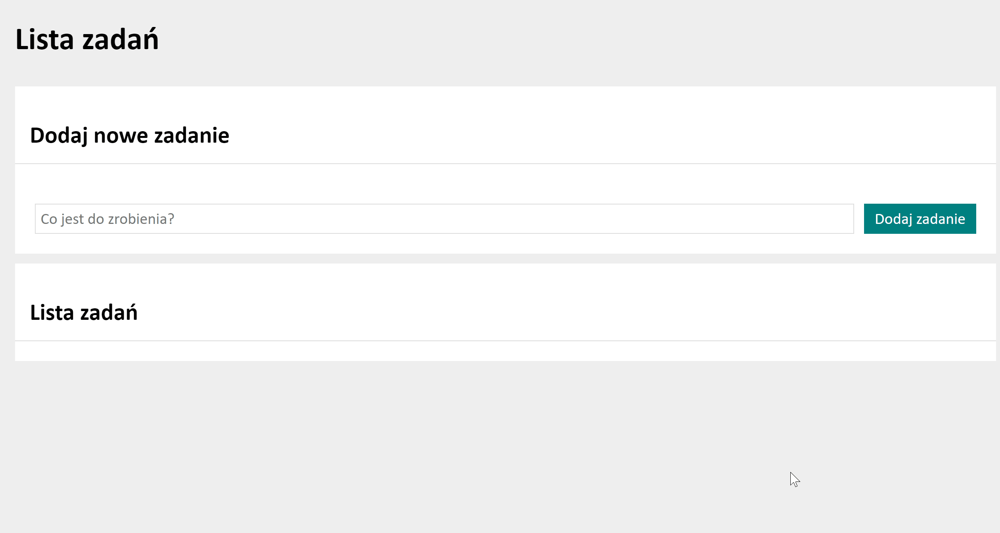

# To do list aplication

## About apliction

This is YouCode homework (modul_6).
In this aplication added tasks to do list.
Lists with 2 buttons are displayed. Buttons have two function:
- green button - when click this button: changed looks button on checked ✅ and added line through
- red button - when click this button: remove task

Uptade 15.01.2023 (homework modul_7)
Added 2 new buutons with new function:
- first button - hidden tasks done
- second button - checked all task done
Refactor "to do list" according to immutability.
Buttons style changing: added transition and transform.

## Demo

https://piotr-godlewski.github.io/tasklist_app/

## Short Animation

## Used technology:

- HTML
- CSS
- JS
- BEM
- FLEXBOX
- GRID